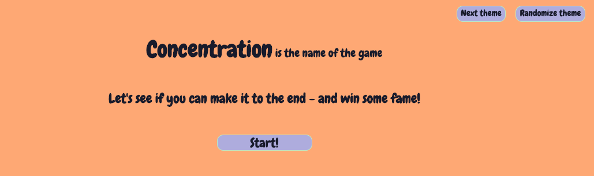
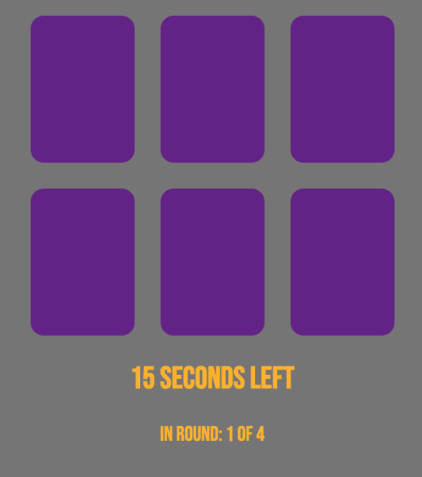
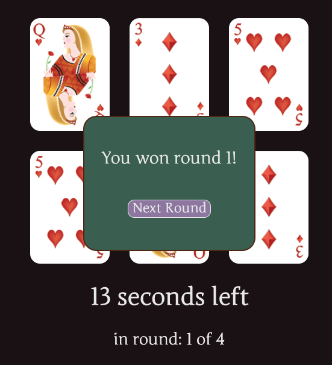
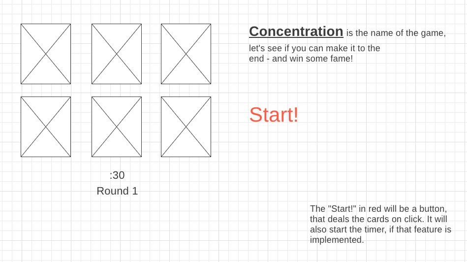
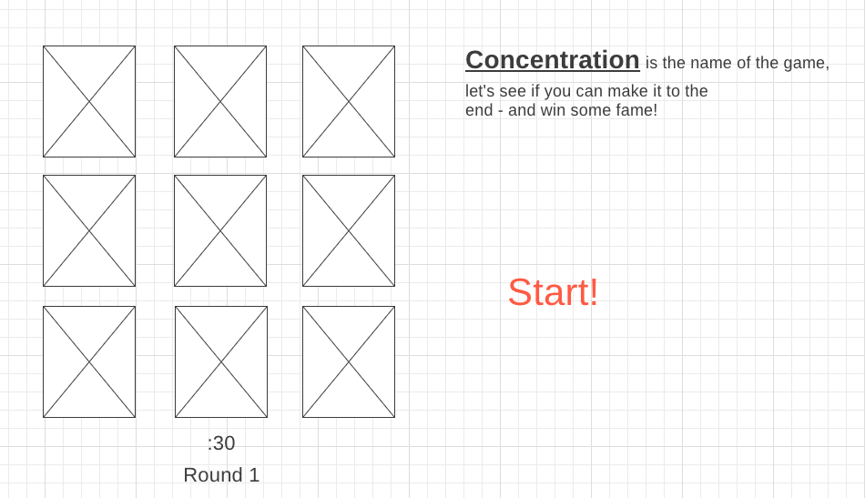
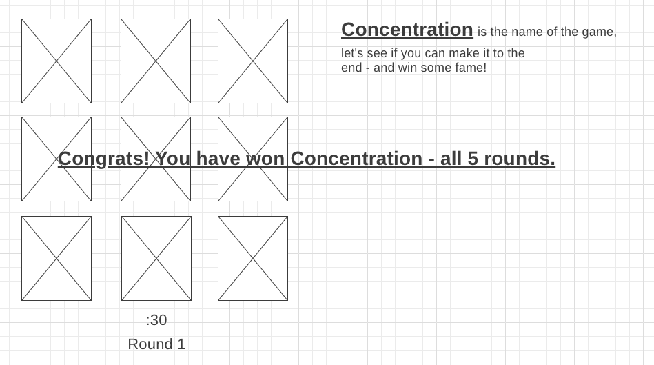

# Concentration

TL;DR : Play the game here: <https://fostimus-concentration.herokuapp.com/>

The classic memory game of "Concentration". This solitary game is played by clicking cards that are face down, and trying to find its matching pair; if you successfully match a card, they will stay face up.

Once you match ALL cards and the board is face up, you win the round. If the timer expires before you finish **any** round, you will be sent back to round 1.

## Motivation

This project was done as an open ended assignment of the General Assembly Software Engineering Immersive program. It served as a final recap and emphasis on: _HTML_, _CSS_, and vanilla _JavaScript_ for game logic and DOM Manipulation.

Personally, I wanted to focus on CSS and using Flexbox to lay out the game board and controls. I accomplished this by making _everything_ on the page use flex in some capacity; I also enabled different themes using CSS variables and JavaScript.

## Screenshots

## User Stories & Wireframes

## Technologies & Code Snippets

All the "magic" happens in JS and CSS. I am especially proud of my usage of CSS variables; by leveraging CSS variables for the style of the game (colors and fonts) I was able to dynamically change the entire theme of the page. In the `themes.js` file is where the actual color values, fonts and image values are defined. The [toggleTheme method](https://github.com/fostimus/concentration/blob/main/js/app.js#L559) is where those CSS variables are dynamically set, which is the method called when the user hits the "Next Theme" button or the "Randomize Theme" button.

I also used Flexbox extensively and in different ways. When adding the modal to the screen, I centered it by adding a parent flex container that was absolutely positioned; then used flex to center it's child--the modal.

The other interesting way I used Flexbox was in the [appendToCardContainer function](https://github.com/fostimus/concentration/blob/main/js/app.js#L4), around line 24 and down. I wanted to better control how the cards would be laid out, so I had preset values for each round (6 cards, 12 cards, etc) and would add a class I made when the columns got to be 6 cards (`.sixcol`).

This game uses media queries to enable a responsive design; it will function and look nice on a mobile phone or a large screen.

Lastly, I tried to adhere to Object Oriented Programming. While not _entirely_ OOP, all methods that deal with game play and the cards are in the concentration object. Doing so made it much easier and efficient to keep track of the cards, rounds, and themes.

## Credits

All images are from Wikipedia or provided by GA through the program. I had a breakthrough in my understanding of client side JS, thanks to [this StackOverflow post and answer](https://stackoverflow.com/questions/22125865/wait-until-flag-true)

## Future Development

-   Refactor to further adhere to object oriented programming principles; ideally I'd like to replace all methods with `concentration.` that exist outside the concentration object, with `this.` and move it within the concentration object. The way it's written, this game only works because there is only ONE concentration object
-   Allow user to customize game details, such as:
    -   Game timer
    -   Click timer
    -   Amount of cards on the board
-   Allow user to customize/choose theme
-   Favicon
-   Update last couple themes
-   Add in sounds - especially when the card is flipped
-   Add in scoreboard - high scores for quickest time
